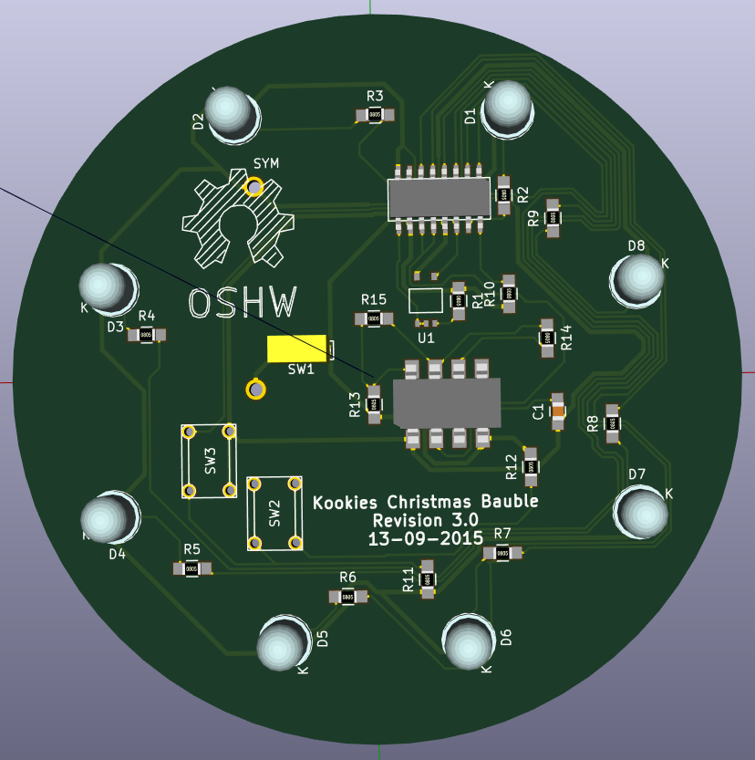
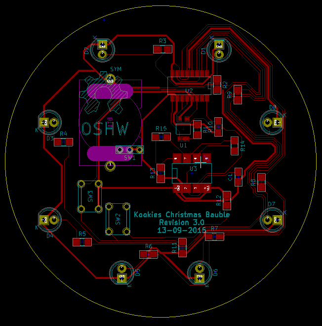
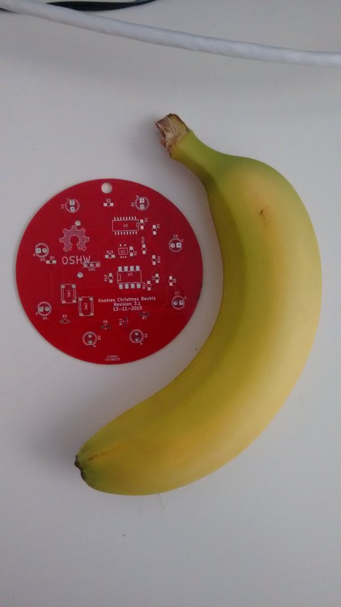

# Kookies Christmas Bauble
A jolly christmas decoration on a PCB. Hoo hoo hoo!

It uses a 555 timer and a shift register + two buttons to generate patterns that are then displayed on a ring of simple LED's on the outside. The perfect thing to hang off your christmas tree in the jolly season (I know I'm early...) :)

The design uses SMD components (except for the LED's that are throughhole). The original schematic and layout was done by Ashley Mills (https://github.com/staropram). **The board requires only one layer**! It can thus be made at home (if the apropriate tools for cutting the PCB are present).

Check out my blog article [here](http://spacekookie.de/hardware/jolly-christmas-decoration/) for details :)
The christmas bauble went into production on 17.11.2015. Unfortunately Revision 3.1 got produced, not the updated and much cooler Rev 3.2** :/ Check out the picture belo.wspi

**All the revision 3 boards up to and including Rev 3.2 have a flaw where the XOR gate (U1) will make the functionality useless!**
Do not solder it on. You have to bridge two pins to make it work. Revision 3.3 fixes the issue.

## Pictures

## Partlist

Battery Holder: http://www.mouser.de/ProductDetail/Keystone-Electronics/3012TR/?qs=sGAEpiMZZMtT9MhkajLHrixYIYDZwOfD%2fKquWGKQDng%3d

Resistors: http://www.mouser.de/Passive-Components/Resistors/SMD-Resistors-Chip-Resistors/_/N-7h7yu?P=1yzmno7Z1yzmotu

595 Shift register: http://www.mouser.de/ProductDetail/Texas-Instruments/SN74HC165DR/?qs=sGAEpiMZZMtYFXwiBRPs00UWwMKcYyCs

555 Timer: http://www.mouser.de/ProductDetail/Texas-Instruments/TLC555CDR/?qs=sGAEpiMZZMuHTYi1bHPYELMHAyKcqQNZ

Capacitor: http://www.mouser.de/ProductDetail/Murata-Electronics/GRM32ER71E226KE15L/?qs=sGAEpiMZZMs0AnBnWHyRQAqZuYDIKiCDcXG6%252bp%252b0hpI%3d (you want 22 µF - Not sure if that's included in the Schematic and I'm too lazy to check right now)

